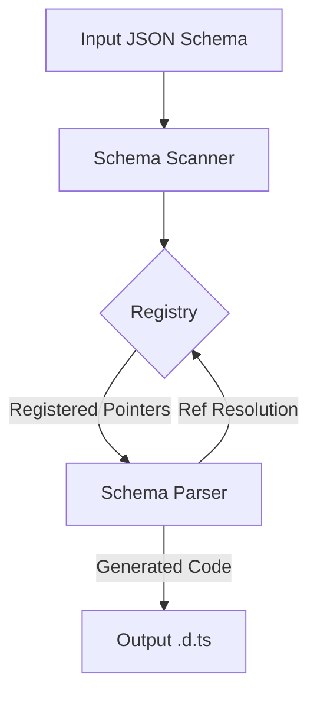

# Development Guide

This document explains the internal architecture and implementation details of `json-schema-to-dts`.

## Architecture Overview

The conversion process is a **Two-Pass Strategy**:
1.  **Scan & Register:** Traverse the schema to identify all types and assign them unique names
2.  **Generate:** Traverse the registry to generate TypeScript code for each registered type.

### Key Components

#### 1. Schema Registry (`src/schema-context.ts`)
A closure-based state container that maps JSON Pointers (e.g., `#/definitions/User`) to TypeScript Type Names (e.g., `User`).
*   **Responsibility:** Ensures every type has a unique, consistent name throughout the generation process.
*   **Conflict Resolution:** Automatically handles name collisions by appending suffixes if needed (e.g., `Status_1`).

#### 2. Schema Scanner (`src/schema-scanner.ts`)
Responsible for traversing the JSON Schema to populate the Registry.
*   **Pass 1 (Traversal):** Recursively walks the schema
    *   Registers explicit definitions (e.g., types in `definitions/` or `$defs/`).
    *   Extracts complex inline objects (e.g., nested `properties` with `type: object`) into their own named interfaces.
    *   Generates descriptive names using **Path-Based Prefixing** (e.g., `Programme` -> `Messaging` -> `Status` becomes `ProgrammeMessagingStatus`).
*   **Pass 2 (Reference Collection):** Scans for all `$ref` pointers
    *   If a referenced pointer wasn't registered in Pass 1 (e.g., a deep pointer to an untitled sub-schema), it registers it on the fly to ensure valid generated code.

#### 3. Schema Parser (`src/schema-parser.ts`)
A collection of pure functions that convert a specific Schema node into a TypeScript code string.
*   **`getTypeFromSchema`:** Determines the TS type (string, number, array, ref, etc.).
*   **`generateTypeDefinition`:** The main entry point. Generates `interface X { ... }` or `type X = ...`.
*   **Smart Intersections:** Handling of `allOf` includes logic to filter out "noise" (like `any` or validation keywords) to preserve strict typing.

#### 4. Integration (`src/index.ts`)
The orchestrator that wires everything together.
1.  Finds schema files using `glob`.
2.  Creates a fresh Registry for each file.
3.  Runs the Scanner.
4.  Iterates through all registered types in the Registry and calls the Parser.
5.  Writes the output `.d.ts` file.

## Code Flow



## Naming Strategies

*   **Normalization:** All names are converted to `PascalCase`.
*   **Prefixing:** Nested types inherit their parent's name to ensure context and uniqueness (e.g., `UserAddress` vs `CompanyAddress`).
*   **Deduplication:**
    *   If a property is a "Simple Reference" (only contains `$ref`), no new type alias is created; it uses the referenced type directly.
    *   If a type name collides (e.g., two totally different `Status` enums), the Registry adds a suffix (`Status_1`).

## Contributing

### Setup
```bash
pnpm install
```

### Build
```bash
pnpm run build
```

### Testing
We use **Vitest** for testing.
*   **Unit Tests:** Located in `__tests__/*.test.ts`.
*   **Integration Tests:** `__tests__/integration.test.ts` runs the full flow against sample schemas.
*   **Complex Scenarios:** `__tests__/complex-schema.test.ts` validates handling of deep nesting, combinators, and references.

```bash
pnpm test
```
