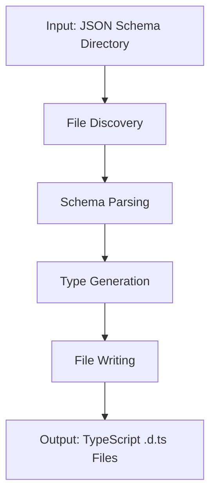

# How the JSON Schema to TypeScript Converter Works

## High-Level Flow



## Detailed Code Walkthrough

### 1. Entry Point: `toTypes()` Function

**Location**: `src/index.ts`

```typescript
export async function toTypes(config: ToTypesConfig): Promise<void>;
```

**What it does**:

1. **Setup**: Creates output directory if it doesn't exist
2. **Discovery**: Uses `glob` to find all `.json` files recursively
3. **Processing**: Iterates through each schema file
4. **Output**: Generates corresponding `.d.ts` files

**Key Steps**:

```typescript
// 1. Find all JSON files
const schemaFiles = await glob("**/*.json", {
  cwd: pathToJsonSchemas,
  absolute: false,
});

// 2. Process each file
for (const relativeSchemaPath of schemaFiles) {
  // Parse JSON → Generate Types → Write File
}
```

### 2. Schema Parsing: `SchemaParser` Class

**Location**: `src/schema-parser.ts`

This is the heart of the conversion logic. Let's break down each method:

#### `getTypeFromSchema()` - The Core Type Mapper

```typescript
private getTypeFromSchema(schema: JsonSchema, rootSchema: JsonSchema): string
```

**Purpose**: Converts JSON Schema type definitions to TypeScript type strings

**Logic Flow**:

```typescript
// 1. Handle references first
if (schema.$ref) {
  return this.toPascalCase(refName); // Convert to TypeScript type name
}

// 2. Handle constants
if (schema.const !== undefined) {
  return typeof schema.const === "string"
    ? `"${schema.const}"`
    : String(schema.const);
}

// 3. Handle enums
if (schema.enum) {
  return schema.enum
    .map((val) => (typeof val === "string" ? `"${val}"` : String(val)))
    .join(" | ");
}

// 4. Handle different types
switch (schema.type) {
  case "string":
    return "string";
  case "number":
  case "integer":
    return "number";
  case "boolean":
    return "boolean";
  case "array":
    return this.handleArrayType(schema);
  case "object":
    return this.generateObjectType(schema);
}
```

#### `generateObjectType()` - Object to Interface Conversion

```typescript
private generateObjectType(schema: JsonSchema, rootSchema: JsonSchema): string
```

**Purpose**: Converts JSON Schema objects to TypeScript interface syntax

**Process**:

1. **Extract Properties**: Get all properties from `schema.properties`
2. **Check Required**: Determine which properties are optional
3. **Generate Property Lines**: Create TypeScript property syntax
4. **Assemble Interface**: Combine into interface body

```typescript
const properties = Object.entries(schema.properties).map(
  ([key, propSchema]) => {
    const isRequired = schema.required?.includes(key) ?? false;
    const propType = this.getTypeFromSchema(propSchema, rootSchema);
    const optional = isRequired ? "" : "?";
    return `  ${key}${optional}: ${propType};`;
  },
);

return `{\n${properties.join("\n")}\n}`;
```

#### `generateJSDoc()` - Documentation Generation

```typescript
private generateJSDoc(schema: JsonSchema): string
```

**Purpose**: Creates JSDoc comments from JSON Schema metadata

**Sources**:

- `schema.title` → Main title
- `schema.description` → Description text
- `schema.examples` → `@example` blocks

**Output Format**:

```typescript
/**
 * Title
 *
 * Description text
 *
 * @example
 * { "key": "value" }
 */
```

### 3. Type Name Conversion

#### `toPascalCase()` - Naming Convention

```typescript
private toPascalCase(str: string): string {
  return str.replace(/(?:^|[-_])(\w)/g, (_, char) => char.toUpperCase());
}
```

**Examples**:

- `user-profile` → `UserProfile`
- `api_response` → `ApiResponse`
- `programme-offer` → `ProgrammeOffer`

### 4. Reference Resolution

#### `resolveRef()` - Handling `$ref`

```typescript
private resolveRef(ref: string, rootSchema: JsonSchema): JsonSchema
```

**Purpose**: Resolves JSON Schema `$ref` pointers to actual schema objects

**Supported Patterns**:

- `#/definitions/TypeName` → `rootSchema.definitions.TypeName`
- `#/$defs/TypeName` → `rootSchema.$defs.TypeName`

### 5. File Processing Logic

**Location**: `src/index.ts` (main loop)

For each JSON Schema file:

```typescript
// 1. Read and parse JSON
const schemaContent = fs.readFileSync(fullSchemaPath, "utf-8");
const schema: JsonSchema = JSON.parse(schemaContent);

// 2. Extract type definitions
const typeDefinitions: string[] = [];
const exportedTypes: string[] = [];

// 3. Process definitions
if (schema.definitions) {
  for (const [defName, defSchema] of Object.entries(schema.definitions)) {
    const result = parser.generateTypeDefinition(defName, defSchema, schema);
    typeDefinitions.push(result.definition);
    exportedTypes.push(result.typeName);
  }
}

// 4. Generate output file
const content =
  typeDefinitions.join("\n\n") +
  "\n\n" +
  exportedTypes.map((typeName) => `export { ${typeName} };`).join("\n") +
  "\n";
```

### 6. Directory Structure Handling

**Path Transformation**:

```typescript
// Input: test-schemas/sub-entities/programme-offer.schema.json
// Output: generated-types/sub-entities/programme-offer.d.ts

const outputFileName =
  path.basename(relativeSchemaPath, ".json").replace(".schema", "") + ".d.ts";
const outputDir = path.join(
  pathToOutputDirectory,
  path.dirname(relativeSchemaPath),
);
const outputFilePath = path.join(outputDir, outputFileName);
```

**Directory Creation**:

```typescript
if (!fs.existsSync(outputDir)) {
  fs.mkdirSync(outputDir, { recursive: true });
}
```

## Type Conversion Examples

### Simple Types

```json
// JSON Schema
{ "type": "string" }
```

```typescript
// TypeScript
string;
```

### Enums

```json
// JSON Schema
{ "enum": ["admin", "user", "guest"] }
```

```typescript
// TypeScript
"admin" | "user" | "guest";
```

### Arrays

```json
// JSON Schema
{
  "type": "array",
  "items": { "type": "string" }
}
```

```typescript
// TypeScript
string[]
```

### Objects

```json
// JSON Schema
{
  "type": "object",
  "properties": {
    "id": { "type": "string" },
    "name": { "type": "string" }
  },
  "required": ["id"]
}
```

```typescript
// TypeScript
{
  id: string;
  name?: string;
}
```

### References

```json
// JSON Schema
{
  "definitions": {
    "User": { "type": "object", "properties": { "id": { "type": "string" } } }
  },
  "type": "object",
  "properties": {
    "user": { "$ref": "#/definitions/User" }
  }
}
```

```typescript
// TypeScript
interface User {
  id?: string;
}

interface RootType {
  user?: User;
}
```

## Error Handling Strategy

### Graceful Degradation

```typescript
try {
  // Process schema file
} catch (error) {
  console.warn(`Failed to process schema file ${relativeSchemaPath}:`, error);
  // Continue with next file
}
```

### Fallback Types

```typescript
// If type cannot be determined
default: return 'any';
```

## Performance Considerations

### Memory Efficiency

- **Streaming**: Process one file at a time
- **No Caching**: Don't hold all schemas in memory simultaneously

### File I/O Optimization

- **Batch Directory Creation**: Create directories as needed
- **Single Write**: Write complete file content in one operation

## Extension Points

The architecture supports future extensions:

1. **Custom Type Mappers**: Override `getTypeFromSchema()` for specific types
2. **Output Formatters**: Modify `generateTypeDefinition()` for different output styles
3. **Validation Rules**: Add schema validation before processing
4. **Plugin System**: Hook into the processing pipeline

This modular design makes it easy to add features like:

- Custom naming conventions
- Additional JSDoc tags
- Type validation
- Import/export strategies
- Multiple output formats
